# System Architecture - Omnirover Project

## High-Level Overview

The Omnirover project implements a wireless-controlled omnidirectional robot with real-time telemetry feedback. The system uses a hybrid microcontroller approach:

- **NXP MCXN947** (ARM Cortex-M33): Core application logic, high-reliability
- **ESP32-C3** (Xtensa): Wireless connectivity (WiFi + ESP-NOW)

## Architecture Diagram

```mermaid
graph TB
    subgraph REMOTE["Remote Control Subsystem"]
        direction TB
        JS["🎮 Joysticks<br/>Analog Inputs<br/>LPADC"]
        RCMCU["MCXN947 Processor<br/>ADC Driver<br/>Vector Control<br/>Command Generation<br/>Display/UI<br/>Status Management"]
        TXWIFI["ESP32-C3 TX Module<br/>SPI Slave<br/>ESP-NOW Driver<br/>WiFi Stack"]
        JS -->|ADC Values| RCMCU
        RCMCU -->|Command Packets| TXWIFI
    end
    
    subgraph LINK[" "]
        direction LR
        WIRELESS["📡 ESP-NOW Wireless Link<br/>2.4 GHz WiFi<br/>Range: ~250m<br/>Latency: ~10-100ms"]
    end
    
    subgraph ROBOT["Robot Subsystem"]
        direction TB
        RXWIFI["ESP32-C3 RX Module<br/>SPI Master<br/>ESP-NOW Driver<br/>WiFi Stack<br/>Bridge Logic"]
        ROBMCU["MCXN947 Processor<br/>Command Parser<br/>Velocity Calculation<br/>Motion Control<br/>Telemetry Management<br/>Feedback Loop"]
        MOTOR["Motor Module<br/>PWM Drivers<br/>Motor 1-4 Control"]
        SENSOR["Sensors<br/>Encoders 4x<br/>ADC Current/Voltage<br/>IMU/Gyro<br/>Limit Switches"]
        RXWIFI -->|SPI Master| ROBMCU
        ROBMCU -->|PWM Control| MOTOR
        MOTOR --> SENSOR
        SENSOR -->|Feedback Data| ROBMCU
        ROBMCU -->|Telemetry via SPI| RXWIFI
    end
    
    TXWIFI -->|Commands| WIRELESS
    WIRELESS -->|Telemetry| RXWIFI
```



## Component Descriptions

### 1. Remote Control Subsystem

#### 1.1 Joystick Input (LPADC)
- **File**: `REMOTE_CONTROL/ADC_FOR_Joysticks_lpadc_interrupt_cm33_core0/`
- **MCU**: MCXN947 CM33 Core
- **Function**: Capture analog joystick inputs
- **Output**: 3-axis vectors (Vx, Vy, rotation speed)
- **Sample Rate**: Configurable (typical: 100 Hz)

#### 1.2 Remote Control Main (MCXN947)
- **Responsibilities**:
  - Poll joystick ADC values
  - Calculate omnidirectional motion vectors
  - Monitor button inputs
  - Generate command packets
  - Manage display/feedback to user
  - SPI communication with WiFi TX module

#### 1.3 WiFi TX Module (ESP32-C3)
- **File**: `ESP32_WIFI/TX/`
- **Primary Function**: Wireless transmitter
- **Duties**:
  - Act as SPI slave to remote control MCXN947
  - Receive command packets via SPI
  - Transmit via ESP-NOW to WiFi RX module
  - Monitor WiFi status
  - Handle connection recovery

**Data Flow**: Joystick → MCXN947 → SPI → ESP32-C3 TX → ESP-NOW → RX Module

### 2. Robot Subsystem

#### 2.1 WiFi RX Module (ESP32-C3)
- **File**: `ESP32_WIFI/RX/`
- **Primary Function**: Wireless receiver & bridge
- **Duties**:
  - Receive commands via ESP-NOW from TX module
  - Act as SPI master to robot MCXN947
  - Transmit commands to robot via SPI
  - Receive telemetry from robot
  - Forward telemetry back to remote via ESP-NOW

**Key Features**:
- Dual SPI role: Master to robot, Slave to remote (not simultaneous)
- ESP-NOW packet aggregation
- Error handling & packet loss recovery

#### 2.2 Robot Main Controller (MCXN947)
- **File**: `OMNIROVER/MCXN947_Project.zip_expanded/MCXN947_Project/`
- **Responsibilities**:
  - Parse incoming SPI command packets
  - Calculate motor speeds for omnidirectional drive (4 wheels)
  - Control motor PWM signals
  - Read sensor feedback (encoders, current, voltage)
  - Package telemetry for transmission
  - Implement safety limits & failsafes
  - Monitor system health

#### 2.3 Motor Control Module
- **Function**: Drive omnidirectional wheels
- **Wheel Count**: 4 wheels (45° offset configuration)
- **Control**: PWM-based speed/direction
- **Feedback**: Encoders per wheel

#### 2.4 Telemetry Path
Motor speeds → Robot MCXN947 → SPI → WiFi RX → ESP-NOW → Remote Display

## Communication Protocols

### SPI Bus Protocol

**Physical Layer**:
- Master: WiFi RX Module (ESP32-C3) or Remote (MCXN947)
- Slave: Robot (MCXN947) or WiFi TX Module (ESP32-C3)
- Clock Speed: 8 MHz typical (see `ESP32_WIFI/TX/8MHz_OPTIMIZATION_NOTES.md`)
- Mode: SPI Mode 0 (CPOL=0, CPHA=0)
- Payload Size: 40 bytes per transaction

**Command Packet Structure (Remote → Robot)**:
```c
typedef struct {
    uint32_t header;        // Sync/validation
    float vx;               // Velocity X (m/s)
    float vy;               // Velocity Y (m/s)
    float phi;              // Angular velocity (rad/s)
    uint32_t buttons;       // Button state bitmask
    uint32_t timestamp;     // Packet timestamp (ms)
} RemoteCommand_t;          // Total: 24 bytes
```

**Telemetry Packet Structure (Robot → Remote)**:
```c
typedef struct {
    uint32_t packet_header; // Sync/validation
    float speed_m1;         // Motor 1 speed feedback
    float speed_m2;         // Motor 2 speed feedback
    float speed_m3;         // Motor 3 speed feedback
    float speed_m4;         // Motor 4 speed feedback
    uint16_t adc_m1;        // Motor 1 current/voltage ADC
    uint16_t adc_m2;        // Motor 2 current/voltage ADC
    uint16_t adc_m3;        // Motor 3 current/voltage ADC
    uint16_t adc_m4;        // Motor 4 current/voltage ADC
    uint32_t reserved_flags;// Status flags
    uint32_t timestamp;     // Packet timestamp (ms)
} RobotTelemetry_t;         // Total: 40 bytes
```

### ESP-NOW Protocol

**Characteristics**:
- **Range**: ~250m in open space
- **Latency**: ~10-100ms typical
- **Bandwidth**: ~250 kbps
- **Frame Size**: Up to 250 bytes per packet
- **Reliability**: No acknowledgment guarantee (connectionless)

**MAC Address Pairing** (REQUIRED):
- TX Module must know RX Module's MAC address
- RX Module must know TX Module's MAC address
- Both must be on same WiFi channel

## Data Flow Sequence (Full Communication Cycle)


## Omnidirectional Motion Model

The robot uses **4 wheels at 45° offset** (mecanum-style or holonomic):

```mermaid
graph TB
    subgraph ROBOT[" "]
        direction TB
        M2["⚙️ M2<br/>Front-Left<br/>Vx - Vy - R*φ"]
        M3["⚙️ M3<br/>Front-Right<br/>Vx - Vy + R*φ"]
        CENTER["🤖<br/>Robot Center<br/>Position & Rotation"]
        M1["⚙️ M1<br/>Rear-Left<br/>Vx + Vy - R*φ"]
        M4["⚙️ M4<br/>Rear-Right<br/>Vx + Vy + R*φ"]
        
        M2 --> CENTER
        M3 --> CENTER
        M1 --> CENTER
        M4 --> CENTER
    end
    
    subgraph INPUT[" "]
        VX["Velocity X Vx<br/>Forward/Backward"]
        VY["Velocity Y Vy<br/>Left/Right"]
        PHI["Angular Velocity φ<br/>Rotation"]
    end
    
    INPUT -.->|Motor Speed<br/>Calculation| ROBOT
```



**Motor Speed Calculation** (example):
```
For velocity (Vx, Vy) and rotation φ:

M1_speed = Vx + Vy - R*φ   (rear-left)
M2_speed = Vx - Vy - R*φ   (front-left)
M3_speed = Vx - Vy + R*φ   (front-right)
M4_speed = Vx + Vy + R*φ   (rear-right)

Where R = robot wheelbase radius
```

## Fail-Safe & Error Handling

### Watchdog Implementation
- **Remote**: Monitors ESP-NOW status & display refresh
- **Robot**: Watches command packet timeout (e.g., 500ms)
- **Action**: Stop motors if no command received within timeout

### Packet Validation
- Header/sync bytes verify valid packets
- Timestamp allows duplicate detection
- Checksum/CRC (if implemented)

### Error Recovery
- Lost packets: Robot continues with last valid command
- Connection loss: Both systems return to safe state (motors stop)
- Brownout: MCU watchdog resets system

## Power Management

### Remote Control
- Battery-powered (USB or internal battery)
- Low-power WiFi sleeping when idle (optional)
- LPADC configured for low-power operation

### Robot
- Powered by motor supply or separate battery
- ESP32-C3 RX powered via voltage regulator
- Sensor power gated if needed

## Testing & Debugging Strategy

### Layer 1: Hardware Verification
- Continuity check on SPI lines
- Measure clock frequency with scope
- Verify GPIO voltage levels

### Layer 2: SPI Communication
- Monitor SPI transactions with logic analyzer
- Verify command bytes received correctly
- Check SPI slave interrupt firing

### Layer 3: ESP-NOW
- Serial monitor logging on both ESP32 modules
- Verify MAC address pairing
- Check WiFi channel matching

### Layer 4: Application Logic
- Validate joystick ADC values
- Check motion vector calculation
- Monitor motor speed feedback
- Verify telemetry aggregation

## Future Expansion Points

1. **Add IMU Feedback**: Implement closed-loop orientation control
2. **Implement SLAM**: Add obstacle detection & mapping
3. **Multi-Robot**: Extend ESP-NOW for swarm control
4. **Secure Communication**: Add AES encryption to ESP-NOW
5. **Enhanced Telemetry**: Expand packet with more sensor data
6. **Autonomous Modes**: Waypoint navigation, line following, etc.

---

**Document Version**: 1.0  
**Last Updated**: December 2025
