# Omnirover Project - Multi-Microcontroller Embedded System

A sophisticated embedded robotics system featuring an omnidirectional rover with wireless control using ESP32-C3 WiFi modules and NXP MCXN947 ARM Cortex-M33 microcontrollers.

## 📋 Project Overview

This project implements a complete wireless robotics platform with the following architecture:

```mermaid
graph TD
    subgraph RC["Remote Control System<br/>(MCXN947 + ESP32-C3 TX)"]
        JS["🎮 Joysticks<br/>ADC Input"]
        RCMCU["MCXN947<br/>Command Gen"]
        TXWIFI["ESP32-C3 TX<br/>SPI Slave"]
        JS --> RCMCU
        RCMCU --> TXWIFI
    end
    
    subgraph WL["WL"]
        direction LR
        WIRELESS["🌐 ESP-NOW WiFi Link<br/>2.4 GHz, 250m range"]
    end
    
    subgraph ROBOT["Robot System"]
        RXWIFI["ESP32-C3 RX<br/>SPI Master"]
        ROBMCU["MCXN947<br/>Motor Control"]
        MOTORS["🔄 Motors<br/>4-Wheel Omni"]
        SENSORS["📊 Sensors<br/>Encoders, ADC"]
        RXWIFI --> ROBMCU
        ROBMCU --> MOTORS
        ROBMCU --> SENSORS
    end
    
    TXWIFI -->|Commands| WIRELESS
    WIRELESS -->|Telemetry| RXWIFI
    SENSORS -->|Feedback| RXWIFI
```



### 🎯 System Components

| Component | Role | MCU | Details |
|-----------|------|-----|---------|
| **Remote Control** | User input & display | MCXN947 CM33 | ADC joysticks, command generation |
| **WiFi TX Module** | Remote transmitter | ESP32-C3 | Sends commands via ESP-NOW |
| **WiFi RX Module** | Robot relay | ESP32-C3 | Bridges SPI↔ESP-NOW, receives telemetry |
| **Robot Controller** | Motor/sensor control | MCXN947 CM33 | Omnidirectional motor control, ADC reading |

## 📁 Directory Structure

```
final-project/
├── ESP32_WIFI/                      # WiFi Bridge Modules (ESP32-C3)
│   ├── RX/                          # Omnirover WiFi Receiver
│   │   ├── main/                    # Main application code
│   │   │   └── main.c              # SPI slave, ESP-NOW bridge
│   │   ├── CMakeLists.txt          # ESP-IDF build config
│   │   ├── sdkconfig               # Menuconfig settings
│   │   └── build/                  # Build artifacts (ignored)
│   │
│   └── TX/                          # Remote Control WiFi Transmitter
│       ├── main/                    # Main application code
│       ├── CMakeLists.txt          # ESP-IDF build config
│       ├── sdkconfig               # Menuconfig settings
│       └── build/                  # Build artifacts (ignored)
│
├── REMOTE_CONTROL/                  # Remote Control Unit
│   ├── ADC_FOR_Joysticks_*/        # Joystick ADC driver project
│   │   ├── source/                 # Source code
│   │   ├── board/                  # Board configuration
│   │   └── Debug/                  # Build artifacts (ignored)
│   └── ...                          # MCUXpresso IDE files
│
├── OMNIROVER/                       # Omnidirectional Robot
│   ├── MCXN947_Project.zip_expanded/
│   │   └── MCXN947_Project/         # Main robot controller
│   │       ├── source/              # Motor control, sensor reading
│   │       ├── drivers/             # Hardware drivers
│   │       └── Debug/               # Build artifacts (ignored)
│   └── ...                          # MCUXpresso IDE files
│
├── .gitignore                       # Git ignore rules
├── README.md                        # This file
└── ARCHITECTURE.md                  # Detailed system architecture (optional)
```

## 🚀 Getting Started

### Prerequisites

- **ESP-IDF v5.x** or later (for ESP32-C3 modules)
  - Install: https://docs.espressif.com/projects/esp-idf/en/latest/esp32c3/get-started/linux_macos_windows_setup.html
  
- **MCUXpresso IDE** (for MCXN947 boards)
  - Download: https://www.nxp.com/design/software/development-software/mcuxpresso-software-and-tools:MCUXpresso
  - NXP MCXn9xx SDK

- **Serial Tools**: esptool.py, miniterm, or similar
- **Build Tools**: CMake 3.16+, Ninja

### Building the Projects

#### ESP32-C3 WiFi Modules (RX - Omnirover Bridge)

```bash
# Navigate to the RX directory
cd ESP32_WIFI/RX

# Configure the project (select target, optimization, WiFi settings)
idf.py menuconfig

# Build the project
idf.py build

# Flash to ESP32-C3 (adjust COM port as needed)
idf.py -p COM3 flash monitor
```

#### ESP32-C3 WiFi Modules (TX - Remote Control)

```bash
cd ESP32_WIFI/TX
idf.py menuconfig
idf.py build
idf.py -p COM4 flash monitor
```

#### MCXN947 Remote Control

1. Open MCUXpresso IDE
2. Import `REMOTE_CONTROL/ADC_FOR_Joysticks_lpadc_interrupt_cm33_core0/` project
3. Build → Build Project
4. Debug → Debug As → MCUXpresso IDE LinkServer

#### MCXN947 Omnirover Robot

1. Open MCUXpresso IDE
2. Import `OMNIROVER/MCXN947_Project.zip_expanded/MCXN947_Project/` project
3. Build → Build Project
4. Debug → Debug As → MCUXpresso IDE LinkServer

## ⚙️ Configuration

### ESP-NOW Pairing

Edit ESP32-C3 source files to set peer MAC addresses:

**ESP32_WIFI/RX/main/main.c:**
```c
/* Update this with Remote Control ESP32's MAC address */
static uint8_t peer_mac[ESP_NOW_ETH_ALEN] = {0x8c, 0xd0, 0xb2, 0xa7, 0xed, 0xe4};
```

**ESP32_WIFI/TX/main/main.c:**
```c
/* Update this with Omnirover WiFi Module (RX) MAC address */
static uint8_t peer_mac[ESP_NOW_ETH_ALEN] = {0xXX, 0xXX, 0xXX, 0xXX, 0xXX, 0xXX};
```

To find your ESP32's MAC address:
```bash
# After flashing, monitor the serial output:
idf.py -p COM3 monitor

# Look for a log line like:
# I (234) wifi: Mode(sta) MAC address: 8c:d0:b2:a7:ed:e4
```

### Communication Protocols

**SPI Configuration (ESP32-C3 ↔ MCXN947 Robot):**
- SPI Frequency: Check main.c for spi_slave_interface_config_t
- Mode: SPI Mode 0 (CPOL=0, CPHA=0)
- Payload Size: 40 bytes (configurable via SPI_PAYLOAD_SIZE)

**Data Structures:**
- RemoteCommand_t: Remote commands (velocity, angles, buttons)
- RobotTelemetry_t: Robot feedback (motor speeds, ADC values)

## 📊 Communication Flow


## 🔧 Troubleshooting

### Build Issues

- **ESP-IDF version mismatch**: Ensure ESP-IDF 5.x is active
  ```bash
  idf.py --version
  ```

- **Python environment issues**:
  ```bash
  python -m pip install --upgrade esp-idf-tools
  ```

- **MCUXpresso SDK missing**: Download appropriate MCXN9xx SDK version

### Communication Issues

- **ESP-NOW not working**: 
  - Verify MAC addresses match between TX/RX modules
  - Ensure both devices are on the same WiFi channel
  - Check serial monitor for ESP-NOW error messages

- **SPI communication failing**:
  - Verify GPIO pin connections (CS, CLK, MOSI, MISO)
  - Check SPI frequency compatibility
  - Ensure proper pull-up resistors on CS line

### Serial Monitor

```bash
# For ESP32-C3 modules
idf.py -p COM3 monitor

# Exit monitor: Ctrl+]
```

## 📚 Documentation Files

- **[ARCHITECTURE.md](./ARCHITECTURE.md)** - Detailed system architecture (create as needed)
- **[ESP32_WIFI/RX/README.md](./ESP32_WIFI/RX/README.md)** - WiFi RX module details
- **[ESP32_WIFI/TX/README.md](./ESP32_WIFI/TX/README.md)** - WiFi TX module details

## 🔐 Git Workflow & Collaboration

### Recommended Git Strategy: **Monorepo (No Submodules)**

Why not use submodules for this project:
- ✅ All components are tightly coupled (same project)
- ✅ Easier to manage versions across all modules
- ✅ Single repository simplifies CI/CD integration
- ✅ Easier for new contributors to clone & build
- ✅ Atomic commits across all components

### Initial Repository Setup

```bash
# Initialize git
git init

# Create initial commit
git add .
git commit -m "Initial commit: Complete omnirover system with ESP32-C3 WiFi and MCXN947 controllers"

# Add remote and push
git remote add origin https://github.com/yourusername/omnirover.git
git branch -M main
git push -u origin main
```

### Branching Strategy

```
main                    # Stable, tested releases
 ├── develop          # Integration branch
 │    ├── feature/esp32-wifi-optimization
 │    ├── feature/robot-motor-control
 │    ├── feature/remote-ui
 │    └── bugfix/spi-communication
 └── release/v1.0
```

### Commit Message Convention

```
<type>(<scope>): <subject>

<body>

<footer>
```

Examples:
```
feat(esp32-rx): implement telemetry aggregation
fix(mcxn947-robot): correct motor direction calculation
docs(readme): update build instructions
refactor(communication): consolidate command structures
```

## 🎓 Contributing

When working on this project:

1. **Create a feature branch** from develop
   ```bash
   git checkout -b feature/your-feature-name develop
   ```

2. **Commit frequently** with clear messages

3. **Clean build artifacts** before committing
   ```bash
   # Remove build directories
   rm -r ESP32_WIFI/*/build
   rm -r */Debug
   ```

4. **Test on hardware** before pushing

5. **Create a Pull Request** for code review

## 📝 Ignoring Files

The `.gitignore` file excludes:
- Build artifacts (`build/`, `Debug/`, `Release/`)
- IDE files (`.vscode/`, `.metadata/`, `.settings/`)
- Generated configuration (`sdkconfig.old`, `config.env`)
- Temporary and log files
- IDE-specific project files

**What you SHOULD commit:**
- Source code (`*.c`, `*.h`)
- Project configuration (`CMakeLists.txt`, `sdkconfig`)
- Documentation and comments
- Board/driver configurations

## 📞 Support & References

- **ESP-IDF Documentation**: https://docs.espressif.com/projects/esp-idf/
- **ESP-NOW Guide**: https://docs.espressif.com/projects/esp-idf/en/latest/esp32/api-reference/network/esp_now.html
- **NXP MCUXpresso**: https://www.nxp.com/mcuxpresso
- **MCXN947 Reference**: https://www.nxp.com/products/microcontrollers-microprocessors/arm-microcontrollers/general-purpose-mcus/mcxn-series-dual-core-high-performance-general-purpose-mcus:MCXN947

## 📄 License

[Add your license here - MIT, Apache 2.0, etc.]

## ✍️ Authors

- Diego Sigala
- David Barragan 
- Dates & Contributions

---

**Last Updated**: December 2025  
**Project Status**: Active Development
